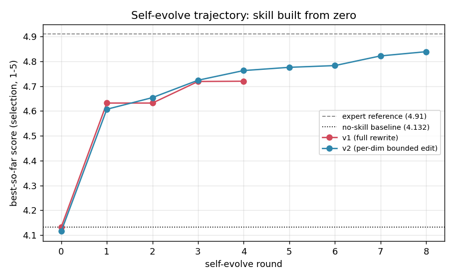
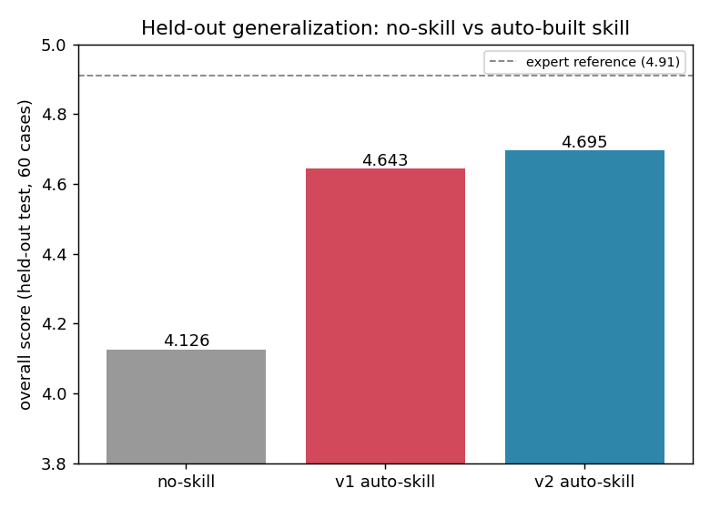
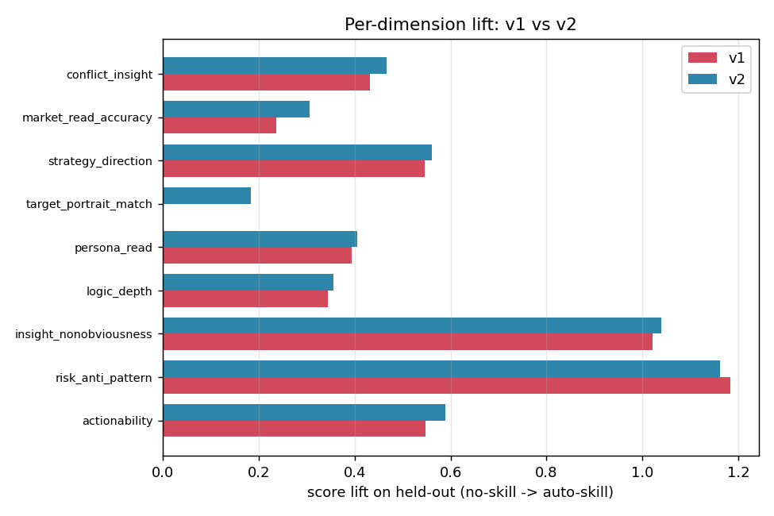

# Experiment 1 — Effectiveness of Self-Evolve

**Question:** Can an automated *Evaluate → Diagnose → Refine* loop build an effective
domain skill **from zero** (no skill at all), and does the resulting skill generalize?

**Answer (this round):** Yes. Starting from a no-skill baseline, the loop authors and
iteratively improves a `SKILL.md` that lifts held-out performance by **+0.52 ~ +0.56**
(on a 1–5 jury scale), and the gains generalize to 60 unseen cases.

---

## Setup

| Component | Choice | Why |
|---|---|---|
| **Generator** | `claude-opus-4-8` (skill applied at inference) | Strong model; show the skill lifts even a frontier model |
| **Skill author / optimizer** | `claude-opus-4-8` | Writes & refines `SKILL.md` from references + judge feedback |
| **Judge jury (PoLL)** | `gpt-5.5` + `gemini-3.1-pro` + `deepseek-v4-pro` | 3 disjoint labs; **none is Anthropic** (generator) or **Qwen** (distill student) → no self-preference bias |
| **Rubric** | 9 dimensions, 1–5, two groups | A = accuracy vs expert ground truth; B = intrinsic analytical quality |
| **Data** | 100 expert-labeled cases → **selection 40 / held-out test 60** (seed 42) | SkillOpt discipline: optimize on selection, report on disjoint held-out |
| **References** | fixed source material, read only while *authoring* the skill (nuwa-style); **not injected at inference** | Inference uses the compact `SKILL.md` only |

**9 rubric dimensions**
- **A (accuracy, vs expert — saturates fast):** `conflict_insight`, `market_read_accuracy`, `strategy_direction`, `target_portrait_match`, `persona_read`
- **B (quality, intrinsic — high ceiling):** `logic_depth`, `insight_nonobviousness`, `risk_anti_pattern`, `actionability`

**Loop discipline**
- 3-judge **validation gate**: a candidate skill is kept only if it strictly improves the selection score (v2 also requires *no dimension regresses beyond a tolerance*).
- The canonical `matchmaker/zh/SKILL.md` is **never mutated**; every round writes a snapshot.
- Fully **resumable**; everything (skill snapshots, author transcripts, every generation
  incl. `<thinking>`, every judge response) is recorded.

---

## Two refiner variants

| | **v1 refiner** (`run_bootstrap.py`) | **v2 refiner** (`run_bootstrap_v2.py`) |
|---|---|---|
| Strategy | full rewrite of `SKILL.md` each round, driven by all critiques | **per-dimension bounded edit**: target the weakest dim, change only the relevant section |
| Search | 1 candidate / round | **best-of-3** candidates / round (3 weakest dims, in parallel) |
| Gate | overall must strictly improve | overall improves **AND no dimension regresses > tol** |
| Memory | none | rejected-edit buffer per dimension |

---

## Results

### Selection trajectory (40 cases, 3-judge gate)



```
v2  4.115 → 4.607 → 4.654 → 4.724 → 4.763 → 4.776 → 4.783 → 4.822 → 4.839
     r0     r1      r2      r3      r4      r5      r6      r7      r8
     (8 rounds, ALL accepted, strictly monotonic — long continuous climb)

v1  4.132 → 4.632 → 4.631✗ → 4.719 → 4.720 (converged)
     r0     r1      r2 rej   r3      r4
     (one big genesis jump + one small gain, then plateau)
```

### Held-out test (60 unseen cases, full jury) — generalization



| Refiner | no-skill | → auto-skill | lift |
|---|---|---|---|
| v1 | 4.12 | **4.643** | +0.523 |
| **v2** | 4.13 | **4.695** | **+0.563** |

Both generalize (held-out lift ≈ selection lift → minimal overfitting).
Expert-written reference answers score ≈ **4.91** under the same rubric (calibration).

### Per-dimension lift on held-out (no-skill → auto-skill)



| Dimension | v1 Δ | v2 Δ |
|---|---|---|
| `target_portrait_match` | **+0.01** ✗ | **+0.18** ✓ |
| `market_read_accuracy` | +0.23 | +0.30 |
| `actionability` | +0.55 | +0.59 |
| `insight_nonobviousness` | +1.03 | +1.04 |
| `risk_anti_pattern` | +1.18 | +1.16 |
| `conflict_insight` | +0.43 | +0.46 |
| `strategy_direction` | +0.55 | +0.56 |
| `persona_read` | +0.39 | +0.41 |
| `logic_depth` | +0.35 | +0.36 |

---

## Findings

1. **Self-evolve from zero works.** A no-skill Opus baseline (≈4.12) is lifted to ≈4.7
   by a skill the loop wrote itself, and the lift holds on unseen data.
2. **Most of the gain is genesis** (round 1: no-skill → first authored skill, ≈ +0.49).
   Iterative refinement adds ≈ +0.1 on top.
3. **The validation gate matters.** v1 round 2 produced a *worse* candidate; the gate
   rejected it, so the skill never degraded.
4. **v2 (targeted bounded edits) is the better refiner:** an 8-round monotonic climb vs
   v1's 2-step plateau, a higher held-out score (4.695 vs 4.643), and it fixed the one
   dimension v1 could never move (`target_portrait_match`: +0.18 vs +0.01).

---

## Reproduce

```bash
cd new_version/experiments/exp1_self_evolve_effectiveness
set -a && source ../../../.env && set +a    # ANTHROPIC / OPENAI / GOOGLE / DEEPSEEK keys

# v1 refiner (full rewrite)
python3 run_bootstrap.py    --selection 40 --rounds 5 --min-rounds 3 --concurrency 16 --final-test

# v2 refiner (per-dimension bounded edits + no-regression gate + best-of-3)
python3 run_bootstrap_v2.py --selection 40 --rounds 8 --k 3 --concurrency 16 --final-test
```

Re-running the same command **resumes** from the last completed case/round.

### Layout
```
common/        rubric.py · judges.py · generator.py · data_split.py
run_bootstrap.py        v1 refiner
run_bootstrap_v2.py     v2 refiner
calibrate_expert.py     scores the expert answers themselves (reference line)
results/
  refine_v1/run/        v1 run (ledger, per-round snapshots, final/ held-out)
  refine_v2/run/        v2 run (best skill: round_08/SKILL_market_read_accuracy.md)
```

### Recorded per run
`ledger.json` (trajectory) · `round_NN/SKILL*.md` (skill snapshots) ·
`round_NN/eval*.jsonl` (per-case generation with `<thinking>` + all 3 judge responses + scores) ·
`final/eval_{noskill,best}.jsonl` (held-out).
